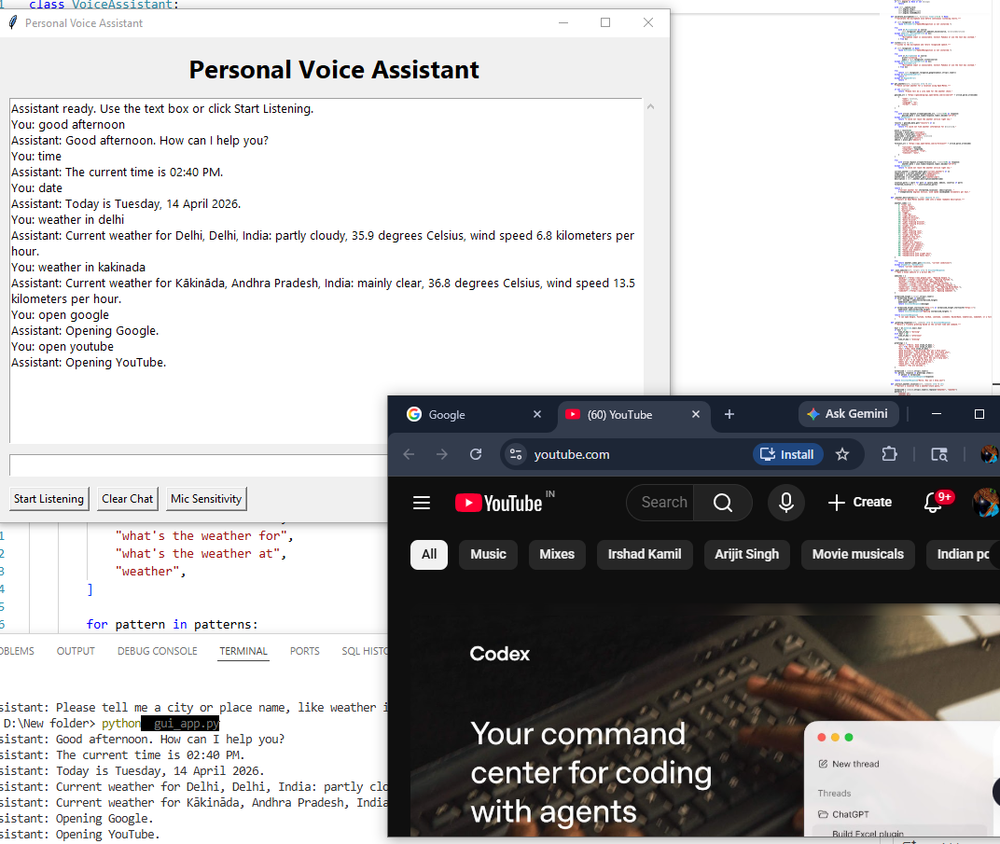

# Voice Assistant

A Python-based voice assistant with a Tkinter desktop interface. It supports typed commands, microphone input, text-to-speech replies, basic web shortcuts, Wikipedia summaries, and live weather lookup.



## Project Summary

This project demonstrates a simple rule-based assistant built for desktop use. It is designed to handle common commands quickly without machine learning, which makes it easy to understand, extend, and present in an internship portfolio.

## Key Features

- Speech recognition for voice commands
- Text-to-speech responses
- Tkinter GUI with typed input and continuous listening
- Website shortcuts for common platforms
- Time, date, weather, and greeting responses
- Wikipedia summaries for quick information lookup

## Tech Stack

- Python
- Tkinter
- SpeechRecognition
- pyttsx3
- PyAudio
- wikipedia
- Open-Meteo API

## Project Structure

- `assistant_core.py` - main assistant logic and command handling
- `gui_app.py` - Tkinter desktop application
- `requirements.txt` - package dependencies
- `image.png` - project screenshot

## Setup

1. Create and activate a virtual environment.
2. Install the dependencies:

   ```bash
   pip install -r requirements.txt
   ```

3. Run the desktop app:

   ```bash
   python gui_app.py
   ```

## Example Commands

- `time` - tells the current time
- `date` - tells the current date
- `open youtube` - opens YouTube
- `open google` - opens Google
- `open github` - opens GitHub
- `open leetcode` - opens LeetCode
- `search wikipedia python` - shows a short Wikipedia summary
- `weather in london` - gets the current weather for London
- `show weather for delhi` - gets the current weather for Delhi
- `exit` or `quit` - closes the assistant

## Notes for Use

- This is a rule-based assistant, not an AI model.
- Microphone input requires `SpeechRecognition` and `PyAudio`.
- Weather lookup needs internet access because it uses the Open-Meteo API.
- If voice input is not available, the text box still works.

## Internship-Ready Summary

This repository is suitable for submission as a beginner-friendly Python project because it includes:

- a working desktop interface
- clear command handling logic
- external API integration
- text and voice interaction
- a clean project structure with installation steps

## Version Control Hygiene

- Keep `.venv` and `__pycache__` out of the repository.
- Commit only the source code, documentation, and dependency files.
- Use descriptive commit messages for future changes.
